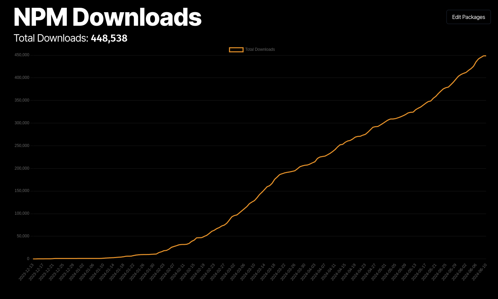

# NPM Accumlated Downloads Charts



This is a simple web app that shows the total downloads for a list of packages over a given time period.

You can simply add and remove packages to the list and the app will show the total downloads. The app also shows the downloads as a line chart for a given time period.

## How to Run or Develop

```bash
pnpm i

pnpm dev
```

## License

MIT
